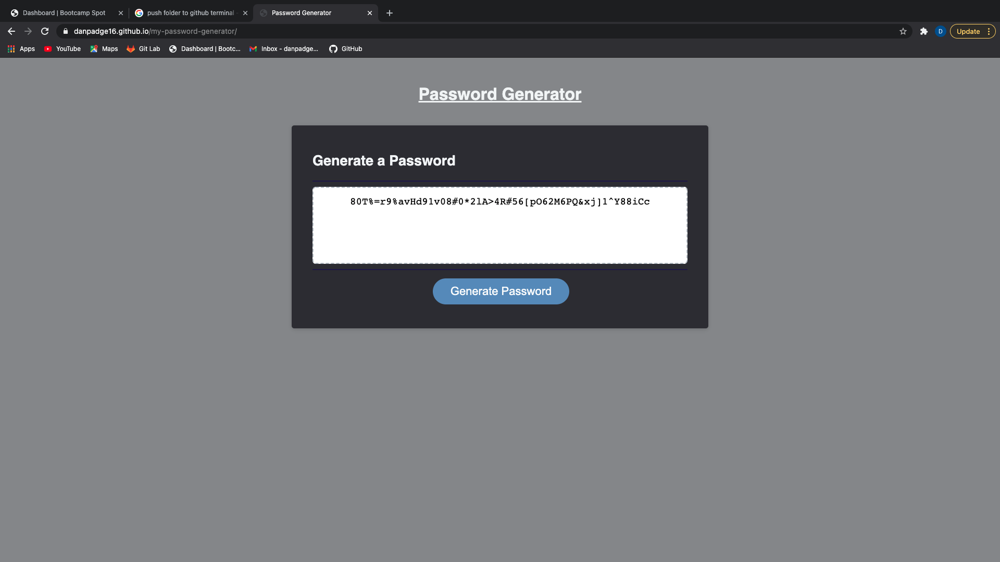

# my-password-generator

This week the homework was to create a password generator using javascript. The objective was to create prompt windows so the user could select the length of the password between 8-128 characters and also what type of character they wanted the password to include from; uppercase and lowercase words, numbers and symbols.

